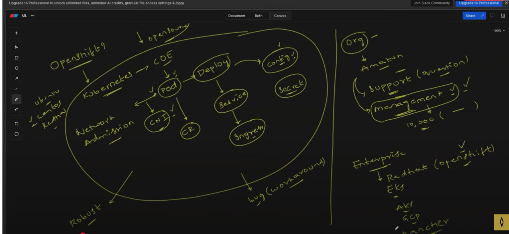
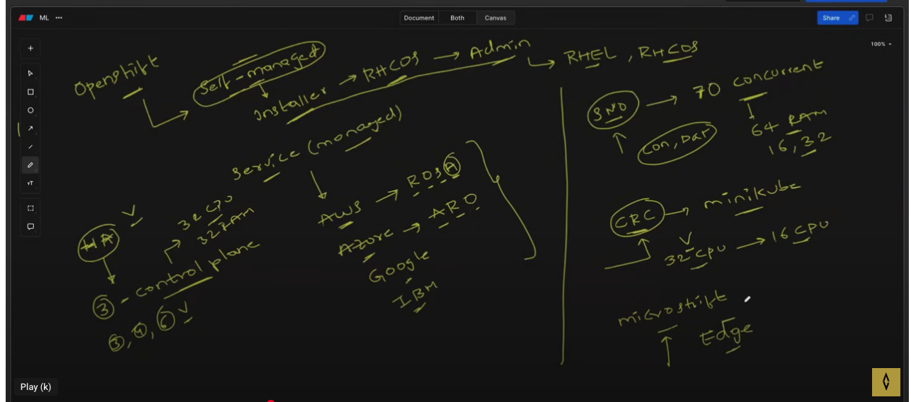

OpenShift
    - Self-Management 
        - RHCOS-Admin (RHCOS)
    - Service - Managed
    - AWS - ROSA
    - AWS - ARO
    - Google - 
    IBMA 
    -- HA
    - 3 Controle Plane -  32 Core CP, 32 GB Ram
    - 4, 6 Worker 

    SNO - Single Node OpenShift - 70 Concurrent Users at once 
    Control Plan, or Data Plane - both are same now 64 GB RAM, 16 or 32 Core CPU

    CRC - Similar to Mini Cube
      32 CPU, 16 CPU
      64 GB Ram
    
    MicroShift - Edge Computing  2gb ram and 2 cpu
    

